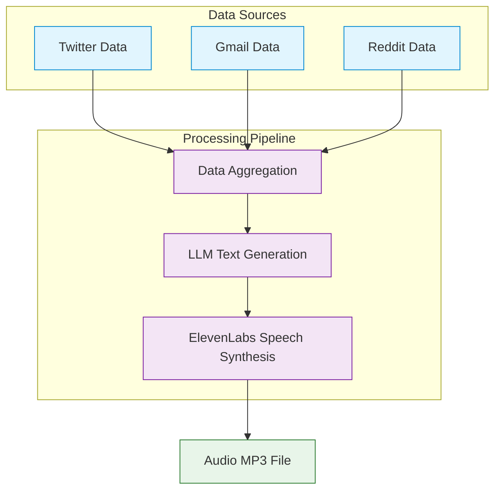

# Voice Pipeline - Mermaid Diagram

Below is a simple visualization of the audio summary generation pipeline using Mermaid.

## Key Steps

1. **Data Collection** - Gather data from Twitter, Gmail, and Reddit
2. **Data Aggregation** - Format and structure data for AI processing
3. **Text Generation** - Process with OpenAI's GPT-4 to create summary
4. **Speech Synthesis** - Convert text to audio using ElevenLabs
5. **Output** - Generate MP3 file for playback in the frontend

This pipeline transforms user activity data into a personalized audio summary that can be played in the application. 