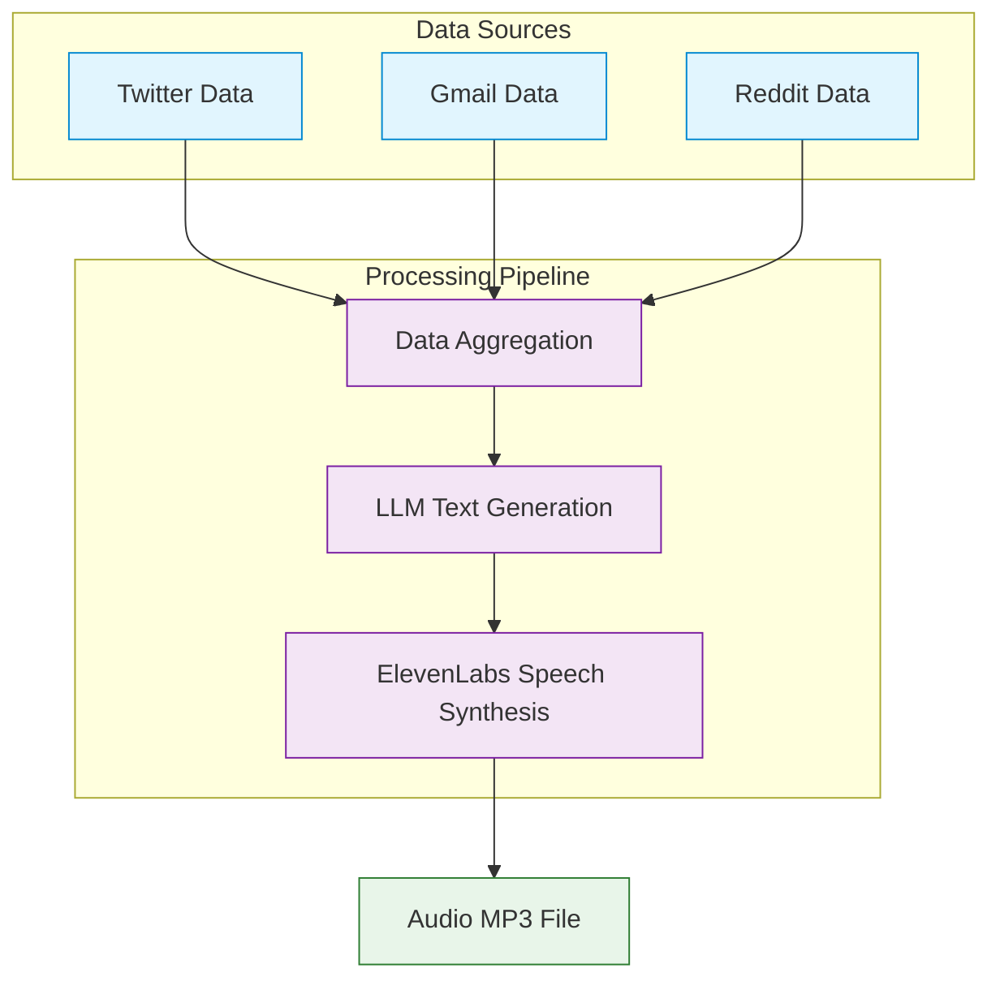

# AI Summariser Project: Technical Documentation

## Overview
The AI Summariser is a web application that aggregates data from various sources (Twitter, Gmail, Reddit), processes it using AI (OpenAI GPT-4), and generates audio summaries through ElevenLabs' text-to-speech service.

## Architecture

### Pipeline Flow


## Backend Components

### Main Server (app.ts)
The backend server is built with Express.js and handles API requests.

```typescript
// Backend Express Server Configuration (app.ts)
import express from 'express';
import cors from 'cors';
import path from 'path';
import routes from './routes';
import { createLogger } from './utils/logger';

const logger = createLogger('App');
const app = express();
const PORT = process.env.PORT || 5001;

// Middleware
app.use(cors());
app.use(express.json());
app.use(express.urlencoded({ extended: true }));

// Serve static files (for audio files)
app.use('/services', express.static(path.join(__dirname, '../src/services')));

// Routes
app.use('/api', routes);

// Health check endpoint
app.get('/health', (req, res) => {
  res.status(200).json({ status: 'ok', uptime: process.uptime() });
});

// Error handling middleware
app.use((err: any, req: express.Request, res: express.Response, next: express.NextFunction) => {
  logger.error(`Error: ${err.message}`);
  res.status(err.status || 500).json({
    error: {
      message: err.message || 'Internal Server Error'
    }
  });
});
```

### Voice Pipeline (voicePipeline.ts)
The core of the backend system is the voice pipeline, which processes data through multiple stages.

```typescript
// Data Structure for Service Data
interface ServiceData {
  twitter?: {
    profileName: string;
    followerCount: number;
    tweetCount: number;
    recentTweetSummary: string;
    engagementRate: number;
    topTweets: string[];
  };
  gmail?: {
    emailCount: number;
    unreadCount: number;
    importantEmails: string[];
    actionItems: string[];
    topSenders: { name: string; count: number }[];
  };
  reddit?: {
    subreddits: string[];
    topPosts: string[];
    commentSummary: string;
    karma: number;
  };
}

// Main Pipeline Function
async function generateAudioSummary(
  outputPath: string = path.join(__dirname, '../../public/services/elevenlabs.mp3')
): Promise<string> {
  try {
    // 1. Generate or retrieve data
    console.log('Generating sample data...');
    const data = generateSampleData();
    
    // 2. Format data for LLM
    console.log('Formatting data for LLM...');
    const prompt = formatDataForLLM(data);
    
    // 3. Generate text with LLM
    console.log('Generating text with LLM...');
    const summaryText = await generateTextWithLLM(prompt);
    console.log('Generated text:', summaryText);
    
    // 4. Convert text to speech
    console.log('Converting text to speech...');
    const audioPath = await convertTextToSpeech(summaryText, outputPath);
    
    return audioPath;
  } catch (error) {
    console.error('Error in voice pipeline:', error);
    throw error;
  }
}
```

### LLM Text Generation
The pipeline uses OpenAI's GPT-4 to generate summary text.

```typescript
// Text Generation with OpenAI
async function generateTextWithLLM(prompt: string): Promise<string> {
  try {
    const response = await axios.post(
      'https://api.openai.com/v1/chat/completions',
      {
        model: 'gpt-4-turbo',
        messages: [
          { role: 'system', content: 'You are an AI assistant that creates concise audio summaries. Keep responses under 1 minute when read aloud.' },
          { role: 'user', content: prompt }
        ],
        temperature: 0.7,
        max_tokens: 500
      },
      {
        headers: {
          'Content-Type': 'application/json',
          'Authorization': `Bearer ${OPENAI_API_KEY}`
        }
      }
    );

    return response.data.choices[0].message.content.trim();
  } catch (error) {
    console.error('Error generating text with OpenAI:', error);
    throw new Error('Failed to generate text with LLM');
  }
}
```

### Speech Synthesis
The pipeline converts text to speech using ElevenLabs API.

```typescript
// Text-to-Speech with ElevenLabs
async function convertTextToSpeech(text: string, outputPath: string): Promise<string> {
  try {
    const response = await axios({
      method: 'post',
      url: `https://api.elevenlabs.io/v1/text-to-speech/${ELEVENLABS_VOICE_ID}`,
      data: {
        text,
        model_id: 'eleven_turbo_v2',
        voice_settings: {
          stability: 0.5,
          similarity_boost: 0.75
        }
      },
      headers: {
        'Content-Type': 'application/json',
        'xi-api-key': ELEVENLABS_API_KEY
      },
      responseType: 'arraybuffer'
    });

    // Ensure the directory exists
    const directory = path.dirname(outputPath);
    if (!fs.existsSync(directory)) {
      fs.mkdirSync(directory, { recursive: true });
    }

    // Save the audio file
    fs.writeFileSync(outputPath, response.data);
    
    return outputPath;
  } catch (error) {
    console.error('Error converting text to speech with ElevenLabs:', error);
    throw new Error('Failed to convert text to speech');
  }
}
```

### API Routes
The backend exposes API endpoints for data retrieval and insights.

```typescript
// Routes Configuration (insightsRoutes.ts)
import { Router, RequestHandler } from 'express';
import { getAIInsights, getServiceInsights } from '../controllers/insightsController';

const router = Router();

// Get AI insights based on connected services
router.post('/ai-insights', getAIInsights as RequestHandler);

// Get service-specific insights
router.get('/service/:service', getServiceInsights as RequestHandler);

export const insightsRoutes = router;
```

### Controllers
The controllers handle API requests and business logic.

```typescript
// Insights Controller (insightsController.ts)
import { Request, Response } from 'express';
import { generateAIInsights, generateServiceInsights } from '../services/insightsService';
import { createLogger } from '../utils/logger';

const logger = createLogger('InsightsController');

export const getAIInsights = async (req: Request, res: Response): Promise<void> => {
  try {
    const { connectedServices } = req.body;
    
    if (!connectedServices) {
      res.status(400).json({ 
        success: false, 
        message: 'Missing required field: connectedServices' 
      });
      return;
    }
    
    logger.info('Generating AI insights for connected services');
    
    const insights = await generateAIInsights(connectedServices);
    
    res.status(200).json({
      success: true,
      data: insights
    });
  } catch (error) {
    logger.error('Error generating AI insights:', error);
    res.status(500).json({ 
      success: false, 
      message: 'Failed to generate AI insights' 
    });
  }
};
```

## Frontend Components

### Main App Structure
The frontend is built with React and React Router for navigation.

```typescript
// App.tsx
import { useState } from 'react'
import { BrowserRouter as Router, Routes, Route, Navigate, useLocation } from 'react-router-dom'
import './App.css'
import Dashboard from './components/Dashboard'
import Auth from './components/Auth'
import Sidebar from './components/Sidebar'
// [Import statements for other components...]

function AppContent() {
  const [isAuthenticated, setIsAuthenticated] = useState(true) // Set to true for development
  const location = useLocation();
  const activePage = location.pathname === '/' ? 'home' : location.pathname.substring(1);
  
  const handleLogin = () => {
    setIsAuthenticated(true)
  }
  
  const handleLogout = () => {
    setIsAuthenticated(false)
  }

  // If not authenticated, show login page
  if (!isAuthenticated) {
    return <Auth onLogin={handleLogin} />;
  }

  // If authenticated, show main layout with sidebar
  return (
    <div className="flex h-screen bg-gray-100">
      <Sidebar 
        onLogout={handleLogout} 
        onNavigate={handleNavigate} 
        activePage={activePage} 
      />
      <div className="flex-1 overflow-auto">
        <Routes>
          <Route path="/" element={<Dashboard onLogout={handleLogout} />} />
          <Route path="/twitter" element={<TwitterPage isConnected={true} onConnect={() => {}} onDisconnect={() => {}} />} />
          <Route path="/gmail" element={<GmailPage isConnected={true} onConnect={() => {}} onDisconnect={() => {}} />} />
          <Route path="/reddit" element={<RedditPage isConnected={true} onConnect={() => {}} onDisconnect={() => {}} />} />
          <Route path="/facebook" element={<FacebookPage isConnected={true} onConnect={() => {}} onDisconnect={() => {}} />} />
          <Route path="/audio-summary" element={<AudioSummaryPage />} />
          <Route path="/settings" element={<SettingsPage />} />
          <Route path="*" element={<Navigate to="/" replace />} />
        </Routes>
      </div>
    </div>
  );
}
```

### Audio Player Component
The audio player allows users to listen to the generated summaries.

```typescript
// AudioPlayer.tsx
import React, { useState, useRef } from 'react';

interface AudioPlayerProps {
  audioSrc?: string;
  title?: string;
  subtitle?: string;
}

const AudioPlayer: React.FC<AudioPlayerProps> = ({
  audioSrc = '/services/elevenlabs.mp3',
  title = 'Your AI Summary',
  subtitle = 'Listen to your daily update narrated by AI'
}) => {
  const [isPlaying, setIsPlaying] = useState(false);
  const [currentTime, setCurrentTime] = useState(0);
  const [duration, setDuration] = useState(0);
  const audioRef = useRef<HTMLAudioElement>(null);

  const togglePlayPause = () => {
    if (audioRef.current) {
      if (isPlaying) {
        audioRef.current.pause();
      } else {
        audioRef.current.play().catch(error => {
          console.error("Error playing audio:", error);
          alert("Audio file couldn't be played. Please make sure the file exists at " + audioSrc);
        });
      }
      setIsPlaying(!isPlaying);
    }
  };

  const handleTimeUpdate = () => {
    if (audioRef.current) {
      setCurrentTime(audioRef.current.currentTime);
    }
  };

  // [Other methods...]

  return (
    <div className="bg-white rounded-lg shadow-md overflow-hidden max-w-3xl mx-auto">
      <div className="relative">
        {/* Visual component */}
        <div className="w-full h-64 bg-gradient-to-r from-indigo-500 to-purple-600 flex justify-center items-center">
          <div className="absolute inset-0 bg-black opacity-30"></div>
          
          <div className="absolute top-1/2 left-1/2 transform -translate-x-1/2 -translate-y-1/2 z-10">
            <button 
              onClick={togglePlayPause}
              className="bg-white rounded-full w-16 h-16 flex items-center justify-center shadow-lg hover:bg-gray-100 transition-colors"
            >
              {/* Play/Pause icon */}
            </button>
          </div>
        </div>
      </div>

      <div className="p-6">
        <h2 className="text-2xl font-bold text-gray-800 mb-1">{title}</h2>
        <p className="text-gray-600 mb-4">{subtitle}</p>

        {/* Audio controls */}
        <div className="mb-4">
          <input
            type="range"
            min="0"
            max={duration || 0}
            value={currentTime}
            onChange={handleSliderChange}
            className="w-full h-2 bg-gray-200 rounded-lg appearance-none cursor-pointer accent-indigo-600"
          />
          <div className="flex justify-between text-sm text-gray-500 mt-1">
            <span>{formatTime(currentTime)}</span>
            <span>{formatTime(duration)}</span>
          </div>
        </div>

        {/* Additional controls */}
      </div>

      {/* Hidden audio element */}
      <audio
        ref={audioRef}
        src={audioSrc}
        onTimeUpdate={handleTimeUpdate}
        onLoadedMetadata={handleLoadedMetadata}
        onEnded={() => setIsPlaying(false)}
        className="hidden"
      />
    </div>
  );
};
```

### Frontend Services
The frontend communicates with the backend API to fetch insights.

```typescript
// insightsService.ts
import axios from 'axios';

const API_URL = 'http://localhost:5001/api/insights';

interface AIInsights {
  contentSummary: string;
  topTrends: Array<{
    name: string;
    count: number;
    source: string;
  }>;
  keyPeople: Array<{
    name: string;
    description: string;
    source: string;
  }>;
}

/**
 * Get AI insights based on connected services
 */
export const getAIInsights = async (connectedServices: Record<string, boolean>): Promise<AIInsights> => {
  try {
    const response = await axios.post(`${API_URL}/ai-insights`, { connectedServices });
    return response.data.data;
  } catch (error) {
    console.error('Error fetching AI insights:', error);
    throw new Error('Failed to fetch AI insights');
  }
};

/**
 * Get service-specific insights
 */
export const getServiceInsights = async (service: string): Promise<ServiceInsights> => {
  try {
    const response = await axios.get(`${API_URL}/service/${service}`);
    return response.data.data;
  } catch (error) {
    console.error(`Error fetching ${service} insights:`, error);
    throw new Error(`Failed to fetch ${service} insights`);
  }
};
```

## Data Flow Process

1. **Data Collection**:
   - The system collects data from Twitter, Gmail, and Reddit through their respective APIs
   - Each service has dedicated endpoints and controllers

2. **Data Aggregation**:
   - Data from different sources is combined into a unified structure
   - Irrelevant information is filtered out to focus on meaningful insights

3. **LLM Processing**:
   - The aggregated data is sent to OpenAI's GPT-4 model
   - A prompt template is used to guide the model to generate a concise summary
   - The model returns a natural-language summary focusing on the most important insights

4. **Audio Generation**:
   - The text summary is sent to ElevenLabs' API
   - The API converts the text to natural-sounding speech
   - The audio file is saved to the server's filesystem

5. **Frontend Presentation**:
   - The React frontend retrieves the audio file URL
   - The custom AudioPlayer component allows users to play the summary
   - Additional UI components display related insights and metadata

## Environment Configuration

The system uses environment variables for API keys and configuration:

- `OPENAI_API_KEY`: For accessing OpenAI's GPT models
- `ELEVENLABS_API_KEY`: For the text-to-speech service
- `ELEVENLABS_VOICE_ID`: Determines the voice personality
- `PORT`: Server port (defaults to 5001)
- `SOCIAL_DATA_API_KEY`: For social media data access
- `SOCIAL_DATA_API_BASE_URL`: Base URL for social media API

## Deployment Considerations

- The backend relies on filesystem access for storing audio files
- API keys should be securely managed in production
- Consider implementing rate limiting for third-party APIs
- Audio files can be served from a CDN in a production environment 